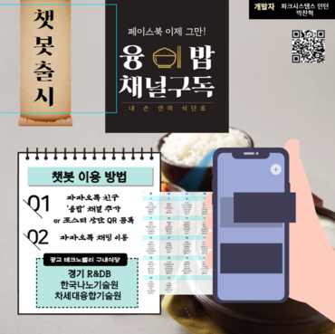
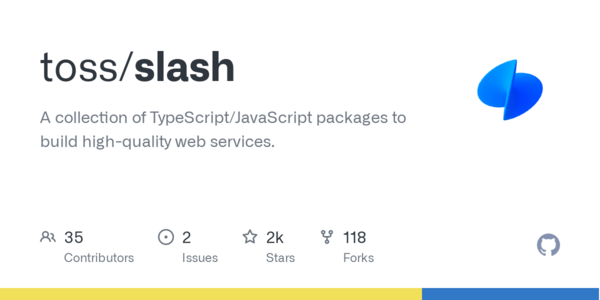
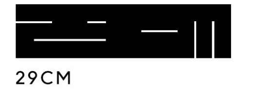
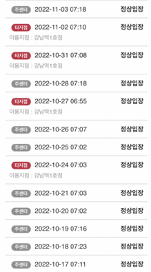

# 들어가며

2022년은 학생이 아닌 **사회인**으로서 첫해이고, 현업 개발자가 되어 처음 일을 한 해이다.

수많은 **좋은** 사람들과 교류할 수 있는 한 해였다. 이뤄낸 것, 이루지 못해 아쉬웠던 것을 정리하며 2023년은 내가 궁극적으로 꿈꾸는 목표를 향해 한발 더 나아가기를 바라며 이번 년을 시간순으로 되짚어 보는 시간을 갖기로 했다.

# 첫 사회생활 나도 **인턴**

3학년에서 4학년 올라가는 겨울방학 학교에서 지원해주는 현장실습이라는 제도를 이용하여 2개월간 웹 개발 인턴을 경험했다. 학교에서 배우는 이론적인 학습 및 토이 프로젝트로는 경험하지 못하는 실무적인 경험을 쌓고 싶었기 때문이다. 실제 사용하는 유저들을 생각하며 개발하는 것이 꿈이였다.
막상 입사하여서 코드를 살펴보니, [PHP](https://www.php.net/)로 구성된 코드가 나를 반겼다. 평소 개발을 배우는데에 언어에 종속되어서는 안 된다고 생각하기 때문에 거부감 없이 익숙해지고자 노력했다. 물론 원하던 개발환경은 아니었지만, [좋은 사수](https://github.com/rnintai)를 만나 책임감 있게 개발하는 방법에 대해서 배웠다.

### 신입 개발자의 영향력💥

두려움 없던 신입이었고, 의견을 잘 들어주는 팀에 속해있었기에 내가 갖고 있던 **신입 개발자**의 참신한 의견들을 많이 제시하곤 했다.

회사에서 운영하고 있던 [NanoScientific Symposium](https://event.nanoscientific.org/)이라는 프로젝트가 있었고, 6개 대상의 국가에 서비스를 진행하는 프로젝트였다. 내가 입사하였을 당시에는 6개의 인스턴스 내에서 각각 워드프레스로 서비스가 운영되고 있었다, 그 당시에는 워드프레스가 제공해주는 이점을 충분히 활용하고 있지 못하다고 생각하였고 다수의 인스턴스로 인한 과금 문제 및 커스터마이징이 용이하지 못하다고 판단하여 나는 팀에게 [리액트](https://reactjs.org/)로의 마이그레이션을 적절한 당위성과 근거를 기반으로 제안하였다. 논의 끝에 마이그레이션이 결정되고, 직접 리액트, Express, MySQL 환경설정을 모두 마치고 Jenkins를 통한 **Continuous deployment**도 진행하였다. 결과적으로 채용시장에서 유리한 리액트로의 마이그레이션은 성공적이었고, 비즈니스적 측면에서도 과금 비용이 절반 이하로 줄어들어 의미있는 마이그레이션이었다고 생각한다. 인턴 기간이 한참 지난 지금도 프로젝트가 내가 세팅해둔 환경대로 잘 진행되고 있는 것을 보면 **신입 개발자**의 **당돌함**이 떠오른다.

### 일단 해보는 시도🙋🏼‍♂️

인턴으로 근무하였던 곳은 수많은 회사와 식당들이 상주해있는 [광교테크노밸리](https://namu.wiki/w/%EA%B4%91%EA%B5%90%ED%85%8C%ED%81%AC%EB%85%B8%EB%B0%B8%EB%A6%AC)내부에 있었고, 인턴 생활 을하며 여러 식당의 식단제공의 플랫폼의 니즈를 느꼈다. 여러 식당의 당일 메뉴를 보기 위해서는 다른 플랫폼을 통해서 각각 확인해야 한다는 불편함을 감지했다. 이를 [카카오톡 챗봇](https://business.kakao.com/info/chatbot/)을 통해서 일원화된 플랫폼으로 사용자에게 제공한다면 충분히 가치가 있다고 판단하였고 Django를 이용해 백엔드를 구축했었다. 실제로 내가 만든 서비스가 사람들의 편의에 기여한다는 것을 느끼고 너무나 뿌듯했었다. 그 당시에는 동기가 너무 대견하다며 마케팅을 도와주면서 홍보 템플릿까지 만들어줬던 기억이 있다. 그 당시에 아직 학생 신분이였지만, 광교테크노밸리라는 한 구역의 사람들에게 영향력을 끼친다는 것 자체로 너무나 큰 영감을 얻었던 것 같다.

### 새로운 시작🚀

 

인턴 기간이 끝을 향해가며 꽃이 필 때쯤 [대학교 동기](https://github.com/minsoo-web)분으로부터 연락이 왔다. 재직 중인 **SI 회사**에서 프론트엔드 개발자를 채용 중인데 괜찮으면 면접을 보라고 하셨다. 너무나 실무적으로 많은 프로젝트를 해보고 싶었기 때문에 SI 업체라면 그러한 나의 니즈를 만족시키기에는 더할 나위 없다고 생각했다. SI는 노예다, 공장이라는 소문이 있었지만 직접 경험해보지 않고 소문으로만 판단하는것이 옳지 않다고 판단했고, **오히려 더 많이 배울 수 있어서 좋은 것 아닌가?** 라는 생각이 나를 [빅픽처팀](http://bigpicture.team/)으로 이끌었던 것 같다.

빅픽처팀을 다니면서 실제로 내가 꿈꾸던 [수많은 프로젝트](https://www.chanhyuk.com/career/bigpicture/)도 진행하고, 개발자로서 사고하는 능력을 많이 배웠다. 시간에 급급하여 작동하는 기능만 구현하는 것이 아닌 회사 차원에서 개발자의 성장을 위해 고민하며 개발할 시간을 제공해줬기 때문에 지금까지 나의 개발자로서의 성장의 90%는 빅픽처팀에서 일어났다고 해도 사실이다. 개발 그 자체 실력뿐만 아닌, 일을 하는 방법 및 여러 사람과 커뮤니케이션하는 방법까지 배울 수 있었다. 내가 빅픽처팀에서 한 일을 리스트업해보면 다음과 같다.

> - 퍼블리싱
> - 프론트엔드 기능 작업
> - 사내 라이브러리 제작
> - 프론트엔드 팀 문화 확립
> - 신기술 검토 및 도입

내가 입사하였을 때 개발자가 2명이었던 것과 달리, 현재는 **10명** 가까이 개발자분을 모시고 있는 것을 보면 팀 성장에 좋은 방향으로 기여했다고 생각한다. 단 한 번도 지난 10개월 동안 **일**을 한다는 느낌을 받은 적 없이, 개발하고 논의하는 과정에서 오히려 즐겼던 것 같다. 언젠간 나도 개발을 일로 생각해버릴 때가 있을 수 있겠지만, 그전까진 최대한 즐기며 맛볼 생각이다.

먼 훗날이어도 누군가에게 **기억나는 팀원들이 있나요?** 라는 질문을 받는다면 나는 틀림없이 **빅픽처팀**에 대한 얘기를 빼놓지 않을 것이다.

### 오픈소스 📂

[2022feconf](https://2022.feconf.kr/)를 라이브로 시청 중에, slash라는 [토스](https://toss.im/)의 사내 라이브러리를 발표한다는 소식을 접하게 되었다. 그 후 [작은 기여](https://github.com/toss/slash/issues?q=involves%3AChanhyukPark-Tech)들을 할 수 있는 기회를 얻게 되었다. 처음에는 **토스 같은 거대한 기업에 내가 어떻게 기여를 해** 라는 생각을 하고 있었는데, 너무나 친절하게 리뷰를 남겨주시고 정확한 근거에 기반을 둔 논의를 이어가는 모습에 프로페셔널하다는 것이 무엇인지를 느낄 수 있었다. 내 개발방식으로만 프로젝트를 이어가고 있던 시기에 이러한 값진 라이브러리를 접한 것은 너무나 나에게 좋은 기회였다고 생각한다. **같은 코드를 보고 다르게 사고하는 방법을 배웠고, 같은 문제를 다르게 해결하는 방법도 배울 수 있었다.** 이 계기를 통해 다른 오픈소스들에도 기여할 수 있는 자신감을 얻을 수 있었다.

이러한 업무 외적인 활동을 통해서 토스 프론트엔드 챕터 리드를 맡고 계신 [박서진](https://github.com/raon0211) 님과도 커피한잔 할 수 있는 기회를 얻을 수 있었고, 짧은 시간이었지만 그 분이 개발을 바라보시는 관점과 토스의 조직원분들이 사고하시는 방향성을 어느 정도 배울 수 있었다. 종종 큰 기업에 종사하고 계신 분들과 이러한 만남을 가지면 좋겠다고 생각했다.

2023년에도 많은 오픈소스에 기여하려고 한다. 또한, 프론트엔드 생태계에서 유용한 오픈소스를 직접 제작하고자 하는 **목표**도 갖고 있다.

### 미래를 위한 결단

정말 잘 다니고 있었고 행복했던 **빅픽처팀**에서의 마무리를 한 해의 마지막 달인 **12월**에 결정지었다. **이직**을 결정한 데에는 여러 이유가 있었지만, 현재 회사에 대한 불만보다는 더 큰 세계로의 욕망이 더 크게 작용했기 때문이다. 내가 은사로 여기고 있는 분께서 나에게 해주신 말이 있다. 나는 이 말에 강력하게 동의하고 있다. 미래에 또 이직에 대한 고려할 상황이 있을 때마다 되새겨 보려고 한다.

> "이직에 있어서 현 회사에 불만이 있어서 하는 것이라면 이유가 적합하지 않고, 더 좋은 곳으로 간다면 축하해줄 이유가 생긴다."

나의 이직 이유는 **세 가지**가 있다.

1. 더 큰 성장을 위한 조직에 대한 갈망 
   어느 정도 프로젝트를 제작 및 유지보수할 수 있는 실력을 갖출 수 있게 되었지만, 기능이 작동해도 이것이 "잘" 작동한다는 확신을 가질 수 없었다. 보다 안정적이고 **Best practice**에 가까운 코드를 많이 접하고 싶었다. 내가 구현하는 방식으로만 구현하는 일종의 **Comfort zone**을 벗어나고 싶었다.
2. 팀원 모두 같은 목표를 위해 뛰어가는 것 
   **자사 서비스**를 운영하며, 각각의 팀원들이 각자의 속도는 다를 수 있지만, 한 방향을 바라보는 조직을 꿈꿨다. 각자의 업무를 일이 아닌, 목표를 이루기 위한 단계라고 생각하고 끊임없이 애자일하게 달려가는 그림을 상상했다.
3. 유저의 소리에 즉각 반응 
   프론트엔드 개발자라면 **유저 경험**을 높이기 위한 많은 고민이 필수 불가결하다고 생각한다. 하지만, 지금까지 나는 유저 경험을 위해 프론트엔드 레벨에서 개선했던 작업이 없었던 것 같다. 물론, 간단한 모달 플로우 개선, 버튼 위치, 표준 웹 접근성 준수 등은 고려하며 개발하였지만, 실제 유저의 피드백을 유용하게 사용하진 못했던 것 같다. **A/B 테스트** 등 여러 시도를 통해 **적극적**으로 유저 경험을 향상할 있는 개발자가 되고 싶다고 생각했다.

위 세 가지 조건을 만족하는 **팀**을 찾으려고 [기술 블로그 모음](https://techblogposts.com/)을 하루에도 몇 번씩 확인하며 개발 조직의 문화를 살펴봤었다.
결과적으로 [29CM(무신사)](https://medium.com/29cm)라는 좋은 팀에 합류하기로 했다. 주니어 개발자의 이직 과정은 회고록에 담기에는 기록하고 싶었던 내 **생각**과 **결정**들이 많기 때문에 추후 다른 블로그 글에 작성할 예정이다.

### 2022년 내가 만난 사람들

나는 사람들과 소통하는 것을 좋아하고, 그들과 좋은 관계를 유지하는 것을 중요하게 생각한다.

2022년 상반기는 학교의 학기를 진행하며, 회사 업무도 진행하였기 때문에 보다 많은 분과 접할 수 있었다. 수많은 사람들을 만났고 모든 사람에게 배울점이 있다는 것을 느꼈다.

- **일**을 잘하는 사람 
  **개발**을 잘하는 것과 **일**을 잘하는 것은 정확히 정비례하지 않는다. 회사라는 곳에 속하여, 비즈니스 가치를 창출하기 위해 일을 잘하는 방법을 알고 행하는 사람을 만났다.
- **커뮤니케이션**에 능한 사람 
  서비스의 규모가 커질수록 히어로 한 명이 개발하는 것은 점점 더 힘들어진다. 결과적으로 **협업**을 하는 상황이 어느 곳에서나 요구되는 상태이다. 협업의 가장 근본적인 수단은 커뮤니케이션이므로 커뮤니케이션의 중요성을 정확히 알고 있다. 상황에 따라, 장소에 따라, 청자에 따라 적절한 단어와 문장을 구사하는 사람을 만났다.

**나는 누군가에게 어떤 사람이었을지 궁금하다.** 2023년에는 누군가 한 해를 회고할 때 나라는 사람이 생각나도록 누군가에게 본받음에 대상이 되고 싶다.
너무나 좋은 사람들을 많이 만났고 2023년에는 어떠한 분들을 만날지 기대가 된다.

### Exclude<chanhyuk,"개발">🙋🏼‍♂️

- 대학교 졸업 
  나는 2개의 전공 학위를 이번 여름에 수여했다. 첫 번째는 내가 대학에 입학했을 때 선택한 **기계공학과**, 두 번째는 내가 대학을 다니며 선택한 **소프트웨어학과**이다. 개발자로 전향하게 된 과거의 나에 대한 칭찬을 해주고 싶고, 그 과거의 나에게 부끄럽지 않게 최선을 다할 것이다. 나는 대학교 다닐 때 교수님의 **요구사항**을 명확히 파악하여 항상 좋은 성적을 받을 수 있었고 이 결과로 **수석 졸업**을 했다. 여러 사람과 협업할 때 가장 중요한 덕목 중 하나가 상대의 **요구사항**을 정확히 파악하는 것이라고 생각한다. 학창 시절 따분한 이론을 배울 때는 사용하지 않을 것 같던 지식이 실제 현업에서 개발할 때도 많이 사용된다는 것을 느꼈다. 프론트엔드에서는 다소 그 부분이 적겠지만, 백엔드 더 나아가 **DevOps**를 다룰 때는 **CS** 지식이 많이 도움이 되었다.

- 건강💪 
  

  처음에 **개발자**라는 직업 특성상 앉아있는 시간이 많아서, 건강상의 이유로 **헬스**를 시작했는데, 이제는 취미가 되어버렸다. 매일 아침 공휴일을 제외하고는 5시 40분에 일어나서 첫 차에 탑승했다. 회사에서 운 좋게 [운동을 사랑하는 분](https://github.com/pupuzel)을 만나게 되었고, 같이 운동하며 많은 도움을 받았다. 주말에는 가끔 자유 수영도 다니고 있다, 어느 정도 안정적인 일을 할 수 있는 시기가 온다면 수영 강습도 받아보고 싶다.

### 2023년 목표

> **이루고자 하는 것, 꿈꾸는 것**

- 새로운 곳에서의 **적응** 
  지금까지 새로운 환경에서 적응하는 것을 두려워하지 않고 오히려 즐겨왔던 것 같다. 그러한 강점을 살려 2023년부터 내가 가장 많이 보낼 **29CM** 개발조직에 자연스럽게 스며들기 위해 노력하고, 그 과정에서 많은 **배움**을 얻고 싶다.

- **튜터링** 
  누군가에게 내가 가진 지식을 전달하는 걸 좋아하고 그래왔기 때문에 어떠한 방향으로라도 내가 가진 **프론트엔드 개발지식**을 전달하고 싶다. [강의](https://www.youtube.com/@user-nh7cv3ks2o/videos)를 촬영할 수도 있고, 스터디를 개설할 수도 있다. 누군가에게 가르칠 정도는 되어야 비로소 그 분야에 어느 정도 **통달**했다고 생각하기 때문이다.

- **오픈소스 제작** 
  위에서도 언급한 것 처럼 프론트엔드 생태계에 유용한 **라이브러리**를 직접 제작하고 싶다. 오픈소스의 유지보수성 및 안정성 측면에서 개인 제작이 아닌 팀 제작이면 좋을 것 같다. 아직 분야는 생각해본 적이 없지만, 일반적으로 자주 사용되는 **유틸성**느낌의 라이브러리보다는 개인적으로 웹 애플리케이션을 다루며 필요한 코어 로직을 담은 라이브러리를 제작하고 싶다. 가장 근접하게 생각하는 방향성은 당근마켓에서 퍼블릭으로 공개한 [stackflow](https://github.com/daangn/stackflow)이다.

- 성공적인 **사이드 프로젝트** 런칭 
  현재 **외국인들이 한국 생활하며 맛있는 음식을 먹었으면 하는 바람**에서 시작한 사이드 프로젝트 [토핑즈](https://github.com/toppingskorea/toppings-client)를 개발하고 있다. 이력서를 정리하다 보니, 성공적으로 런칭한 사이드 프로젝트가 1개뿐이라는 사실에 놀라웠다. 실제 진행한 사이드 프로젝트는 많았지만, 어느샌가 흐지부지 되어버리는 경우가 많았던 것 같다. 이번 프로젝트는 기획부터 참여한 만큼 우리 팀이 꿈꾸는 궁극적인 목표를 실현하는 결과를 가져오는 2023년이 되었으면 좋겠다. **그럴 것이다**

- **정독** 하는 습관 
  개발을 시작하며 해결해야 할 문제가 있으면, 깃허브 이슈, [stackoverflow](https://stackoverflow.com/)등 여러 질문에 따른 답변을 보며 해결했던 것 같다. 항상 답변의 좋아요 수 및 추천 수가 높은 답글만 제대로 정독하고, 그 외에 추천받지 못한 답변은 무시한 채 읽지 않은 경우가 많았는데 점점 내가 해결해야 할 문제가 고도화될수록 모든 정보를 천천히 읽되, 필요한 정보를 추출하는 것이 중요해졌다고 생각한다. 여러 문서를 **정독**하는 습관을 지닌 뒤, 올바르게 수용하는 방법을 깨달을 것이다.

- **집중력** 키우기 
  하나의 업무를 수행하고 있을 때 그 업무 자체에 몰입하는 시간이 부족했던 것 같다. 최대한 컨텍스트 스위칭을 줄이고 같은 시간 대비 최대한 효율을 내기 위해 **집중력**을 키우기 위해서 노력할 것이다.

### 나아가며

모든 개발자가 하나같이 말하는 것과 같이 나 또한 **성장**에 중요한 가치를 두고 있다. 2023년에는 새로운 곳에서의 만남과 배움이 기다리고 있고, 새로운 내가 지금의 나를 기다리고 있다. 2023년 회고를 하기 위해 이 글을 다시 돌아봤을 때는
**저럴 때도 있었구나**라고 생각하며 성장해있는 내가 있기를 바란다.
