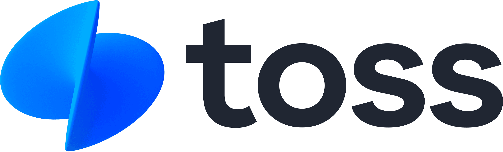
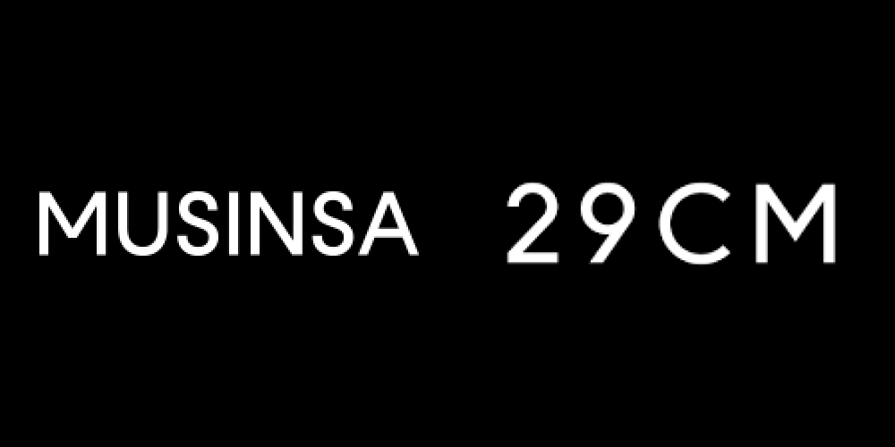
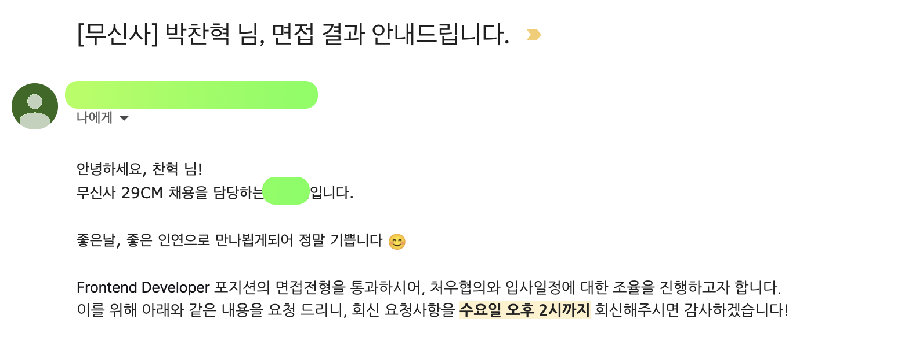

# 들어가며

**이직**이란 개인에게 있어서 엄청나게 큰 이벤트라고 생각한다, 개인이 집 이외에 가장 많은 시간을 머무를 회사라는 곳을 새롭게 선택하는 행위이기 때문이다. 그렇게 중요한 이벤트기 때문에 내가 평소에 생각하지 못하는 방향으로 생각해 볼 기회도 많았고 상황도 많았다. 가까운 시일 내에는 이직을 다시 하진 않겠지만, 추후 다른 이직을 고려할 때 이 글을 보면 더 나은 선택을 할 수 있을 것 같다고 생각하기 때문에 글로 정리해서 기록해두려고 한다. 또한 복잡한 생각들을 차분하게 정리하여 기록해두는 것만으로도 **성장**하는 것으로 생각한다.

# 전에 내가 머무른 곳 

나의 첫 번째 직장은 [**빅픽처팀**](http://bigpicture.team/)이라는 역삼동에 위치한 광고 대행사이다. SW 사업팀이라는 팀에 속해서 약 10개월간 개발을 했다. 내가 한 주 업무는 광고주의 홈페이지를 제작하는 일이었다. 첫 번째 직장을 선택할 때 내가 이 회사를 선택한 이유는 다양한 기술 스택 및 프로젝트에 대한 경험이었다. 실제 회사의 업무가 SI 업체와 비슷하게 진행되었기 때문에 다양한 기술 스택으로 다양한 경험을 할 수 있어서 너무 행복했다. 개발실력을 향상하기 위해서 사이드 프로젝트를 하는 분들도 계시고, 사이드 프로젝트를 구하는 플랫폼도 많은 것을 알고 있었다. 나도 개발실력을 향상하기 위해 사이드 프로젝트는 너무나 좋다고 생각한다, 하지만 사이드 프로젝트는 어디까지나 사이드 프로젝트이고 유지보수를 진행하지 않고, 흐지부지되는 경우가 많다고 생각했다. 나 또한 그랬기 때문이다. 그와 반대로 현업에서 실제 비즈니스적으로 구축된 프로젝트들은 코드의 안정성은 물론 유지보수까지 신경 써야 하므로 현업에서 다양한 프로젝트를 하는 행위가 너무 좋다고 생각했다. 그래서 이 회사를 선택한 것이었다. 한국 사회에서 SI 업체가 기피 대상이 되고, 풍자 대상이 되고 많은 기업이 안 좋은 인식이 세겨진것과 달리 내가 근무했던 빅픽처팀은 개발자로서의 성장에 좋은 팀이었다. 개개인별 적극적인 의사소통을 통해 원하는 기술 스택을 이용하여 프로젝트를 구축할 수 있었다. 그 결과 나는 프론트엔드 개발자로서 5개 이상의 비즈니스 레벨의 프로젝트를 10개월이라는 기간에 구축하는 아주 값진 경험을 했고, 그 과정에서 **폭풍 성장**을 경험할 수 있었다.

# 이직을 결정하게 된 이유

정말 잘 다니고 있었고 행복했던 **빅픽처팀**에서의 마무리를 한 해의 마지막 달인 **12월**에 결정지었다. **이직**을 결정한 데에는 여러 이유가 있었지만, 현재 회사에 대한 불만보다는 더 큰 세계로의 욕망이 더 크게 작용했기 때문이다.

나의 이직 이유는 **세 가지**가 있다.

1. 더 큰 성장을 위한 조직에 대한 갈망 
   어느 정도 프로젝트를 제작 및 유지보수할 수 있는 실력을 갖출 수 있게 되었지만, 기능이 작동해도 이것이 "잘" 작동한다는 확신을 가질 수 없었다. 보다 안정적이고 **Best practice**에 가까운 코드를 많이 접하고 싶었다. 내가 구현하는 방식으로만 구현하는 일종의 **Comfort zone**을 벗어나고 싶었다.
2. 팀원 모두 같은 목표를 위해 뛰어가는 것 
   **자사 서비스**를 운영하며, 각각의 팀원들이 각자의 속도는 다를 수 있지만, 한 방향을 바라보는 조직을 꿈꿨다. 각자의 업무를 일이 아닌, 목표를 이루기 위한 단계라고 생각하고 끊임없이 애자일하게 달려가는 그림을 상상했다.
3. 유저의 소리에 즉각 반응 
   프론트엔드 개발자라면 **유저 경험**을 높이기 위한 많은 고민이 필수 불가결하다고 생각한다. 하지만, 지금까지 나는 유저 경험을 위해 프론트엔드 레벨에서 개선했던 작업이 없었던 것 같다. 물론, 간단한 모달 플로우 개선, 버튼 위치, 표준 웹 접근성 준수 등은 고려하며 개발하였지만, 실제 유저의 피드백을 유용하게 사용하진 못했던 것 같다. **A/B 테스트** 등 여러 시도를 통해 **적극적**으로 유저 경험을 향상할 있는 개발자가 되고 싶다고 생각했다.

# 이직의 시작

## 지원 플랫폼

현재 개발자들의 채용공고 플랫폼은 시장에 많이 존재하지만, 나는 주로 [**원티드**](https://www.wanted.co.kr/)라는 플랫폼을 이용해서 지원했다. 특별한 이유는 없지만 가장 많은 기업이 등록되어있고 UI가 사용자 친화적이라고 생각했기 때문이다.

## 이력서 구성

이전 직장도 채용공고를 통해서 지원한 것이 아닌, 추천받아서 회사에 들어갔던 것이어서 **이력서**를 처음 제대로 작성하고 정리하는 시간을 가졌다. 이력서는 최대한 간단하게 구성했고, 다른 프론트엔드 개발자와 비교했을 때 강점은 **오픈소스 기여 활동**이라고 생각했다. 나 또한 이전 회사에서 타 지원자분들의 이력서 검토를 많이 진행했기 때문에 어느 정도 형식적인 이력서를 많이 본 경험이있다. 그때 **오픈소스 기여 활동**을 한 분이라면 조금 더 실력으로 신뢰가 가곤 했기 때문이다.

### 오픈소스가 이력서에 끼치는 영향
수많은 부트캠프 속에서 비슷한 역량을 가진 개발자들이 많이 양성되고 있다. 잘 짜인 커리큘럼에서 교육받은 분들이기 때문에 개발실력은 좋을 수밖에 없다, 하지만 수요와 공급의 원칙에 따라 현재 개발자가 되고자 하는 사람의 수보다 회사의 자리가 부족한 상황이다. 그때 과연 남들처럼 똑같이 커리큘럼을 진행하고 똑같은 이력서로 지원했을 때 좋은 이미지를 받을 수 있을까? 아니라고 생각한다. 그래서 나는 신입 개발자일수록 **오픈소스 활동**을 하는 것이 중요하다고 생각한다. 물론 진짜 **오픈소스 활동**에 관심을 두고 진정으로 활동하는 것이 중요하다. 이력서에 한 줄 더 작성하기 위해 억지로 **오픈소스**에 기여하는 것은 차라리 안 하는 것이 더 좋다고 생각한다. 

# 내가 지원한 곳의 성격

>- 유지보수가 많이 일어나는 **자사 서비스**를 하는 곳. 
>- 유저의 피드백(데이터) 기반 의사 결정을 진행하는 곳
>- 객관적으로 기술적으로 뛰어나다고 생각하는 곳
>- **개발문화**가 잘 발달하여 있고, 개발조직에서 힙함이 느껴지는 곳
>- 내가 관심 있는 분야의 서비스를 진행하는 곳
>- 3년 차 이하 주니어 개발자 채용 공고
>- **react** 기반 기술 스택으로 서비스를 운영하는 곳
>- 코딩테스트를 보지 않는 곳

위 선택지를 모두 만족하는 회사는 아니어도, 몇 가지 이상을 만족시킨다면 지원했다.
그렇게 많은 회사에 지원하지는 않았지만, [29CM](https://www.29cm.co.kr/) 빼고는 모두 서류에서 탈락했다. 오히려 좋았던 점은 기나긴 채용 프로세스들을 겪지 않고, 서류에서 떨어져서 심리적, 신체적 리소스는 사용하지 않을 수 있어서 좋았다.

## 코딩테스트에 대한 생각
기업 입장에서 수많은 지원자를 기술적으로 선별하기 위해서, **코딩테스트**는 효율적인 프로세스라고 생각한다. 하지만, 나는 과연 **코딩테스트**가 필수인가? 라는 의견에는 아니라고 생각한다. 더군다나 **프론트엔드 개발**에 있어서는 복잡한 알고리즘과 실제 웹 서비스를 구성하는 것은 어느 정도 이격이 있다고 생각한다. 기업 입장에서도 좋은 신규입사자를 얻기 위해선 어느 정도 리소스를 투자해야 한다고 생각한다. 점수를 메겨서 빠르게 채점할 수 있는 코딩테스트를 선택하는 것도 방법이 될 수 있지만, 보다 시간이 걸리더라도 실무에서의 실력을 체크할 수 있는 과제를 보는 기업을 더 선호했다.

## 지원할 때의 생각

많은 걱정 그리고 두려움도 있었다. 약 5개 정도 회사에 지원했는데 한 곳을 제외하고 모두 서류에서 떨어졌기 때문이다. 꽤 많고, 규모가 있는 프로젝트에 프론트엔드를 개발해왔다고 생각했는데 실제로 큰 기업에서 봤을 때는 평범한 이력서 중 하나라고 여겨진 것 같다. 회사에 다니면서 이직을 진행했지만, 회사를 그만두고 이직에 전념해야 하는가까지 생각을 한 적도 있다. 

# 진행한 채용 프로세스

윗글에서 서류 합격을 **29CM**에서만 받았다고 기술했지만, 토스 프론트엔드 챕터 리드를 맡고 계신 [박서진](https://github.com/raon0211)님이 너무나 감사하게도 **비바리퍼블리카**로의 추천서를 작성해주셔서 토스의 채용프로세스를 밟는 영광을 누릴 수 있었다.

총 두 가지 기업의 채용프로세스를 진행했고, 둘 다 너무 좋은 경험이었다.

## 비바리퍼블리카

### 서류 전형

2022년 10월 추천서를 받고 진행한 프로세스였기 때문에 서류는 합격할 수 있었다. 토스의 서류 전형은 자유양식이고, 다른 기업에서 물어보는 가장 기억에 나는 협업이 무엇인가요?, 어려움이 있다면 어떻게 극복하시나요? 이러한 질문들에 답을 할 필요가 없어서 좋았다.  

### 과제 전형

과제를 진행하는 과정 자체에서도 너무나 행복했고, 개발자 경험이 좋았다. 주관적으로 생각하기에 웹 기술적으로 1위라고 생각하는 [**토스**](https://toss.im/)는 어떻게 과제를 부여하고 검증하는지 너무나 궁금했었다. 과제를 풀면서 그러한 궁금증이 해소되었고 더욱 선망하게 되었다. 과제가 끝나고도 코드를 참고하여 공부하기 위해서 많은 시간을 쏟아부으면서 분석하는 시간을 가질 수 있었고, 또한 성장하는 계기가 되었다.

과제 전형의 결과는 약 1주일 뒤에 받을 수 있었고 합격이라는 결과를 받았다. 1주일을 기다리는데 나에겐 1년 같았지만, 지원자 수를 고려해봤을 때 납득할만한 기간이었다고 생각한다.

### 1차 면접

1차 면접은 화상으로 진행되었다. 과제와 면접 사이에 기간도 넉넉했기 때문에 수많은 준비를 했었다. 내가 과제를 진행하면서 했던 생각들, 그리고 내가 직접 구현한 코드에 관해 설명할 수 있을 정도로 깊게 분석했다. 평소 토스의 기술 컨퍼런스인 SLASH도 많이 시청했기 때문에 면접관 분들과 기술적 대화를 진행할 생각에 설렜었다. 역시 경험이 많으신 면접관 분들과 면접을 진행할 수 있었고, 내가 평소에 생각해보지 못했던 부분까지 질문을 받아서 더 다양한 방면으로 생각해볼 기회였던 것 같다. 면접은 서로 기술적 논의를 잘 이어 나가고, 분위기도 좋았던 것 같았다. 아쉬웠던 점은 비대면이 아닌 대면으로 면접을 진행했으면 더 깔끔한 의사소통을 할 수 있었을 것 같다.

>면접 결과는 하루 뒤에 받을 수 있었고, 불합격이었다. 면접 과정에서 질문에 대한 대답을 잘했다고 생각하고 합격할 것 같다고 생각했지만, 이 또한 나의 생각이었고 면접관분들의 생각은 달랐던 것 같다. 짧은 시간이었지만 토스의 개발자분들은 어떠한 방향으로 사고하시는지 대화를 나눌 수 있었다는 그 자체로 영광이었다.

### 느낀점

깔끔한 채용프로세스를 갖고 있고, 코딩테스트를 보지 않아서 좋았다. 짧은 시간이었지만 토스에서는 기술을 어떻게 바라보는지 느낄 수 있었고 미래에 꼭 한번 일해보고 싶은 곳이라고 다시 한번 느낄 수 있었다.

## 무신사(29CM)

### 서류 전형

2022년 11월 23일 원티드를 통해서 서류를 제출하였다. 서류 전형은 꽤 시간이 소요되었던 것 같다. 약 일주일 정도였던 것으로 기억한다. 당시에 세 군데 정도 다른 회사로부터 서류 전형을 통과하지 못한 상태였기 때문에 떨어질 거라는 마음이 컸던 것 같다. 이메일로 합격 연락을 받았고, 바로 과제 전형에 대한 공지도 받을 수 있었다. 

### 과제 전형

**29CM** 또한 코딩테스트를 진행하지 않고, 과제 전형으로 지원자들의 기술 실력을 선별해주기 때문에 너무 좋았다. *과제 자체가 특정 기술과 상황을 제약하기 보다는 지원자가 가진 다양한 실력을 뽐낼 환경을 만들어주는 형식이었다.* 내가 평소에 자신 있던 웹 서비스를 개발하는 것 자체가 과제의 주목표였기 때문에 너무나 자신 있었다. 거대한 패션 플랫폼에서는 어떠한 실력을 평가하기 위해서 각 요구사항을 제시했는지 역으로 사고하며 과제를 진행했던 것 같다. 처음에는 바로 이해가 안되는 요구사항들도 있었지만, 과제를 진행하고 실제 29CM 서비스를 이용해보면서 담당자분들이 제시했던 요구사항과 그 이유 및 평가하고자 하는 척도를 알 수 있었다. 실제 다른 사이드 프로젝트였다면, 이유 없이 구현했을 법한 코드들도 과제를 진행하면서 더 깊고 완벽하게 사고할 기회여서 너무 좋았었다. 

전 직장을 다니면서 과제를 진행했기에 주어진 모든 시간을 사용할 수 없었고, 과제로 부여된 시간의 30% 정도밖에 사용하지 못하고 제출했지만, 그 짧은 시간 속에서 엄청 재밌었고 패션 플랫폼 내부의 작은 마이크로 서비스를 하나 만드는 느낌을 받을 수 있어서 큰 집중력을 발휘할 수 있었다. 

과제 전형 결과를 받기 까지 꽤 시간이 걸렸던 것 같다. 제출을 빨리한 이유 때문인지 약 일주일 정도 걸렸던 것 같다. 29CM은 그리팅을 통해 채용을 진행하고 있었는데 지원자로서의 경험이 너무 좋았다. 면접 시간 선택과 같은 것도 비동기적인 프로세스로 잘 짜여 있고, 확실하게 좋은 UI를 제공받았기 때문에 기업 자체에도 긍정적인 인식을 가질 수 있었다.

### 1차 면접

1차 면접은 대면 면접으로 진행되었다. 평소에 비대면 면접보다는 대면 면접에 자신이 있고, 마음이 편안했기 때문에 좋았다. 2시간 동안의 기술 면접이 되어있다고 해서 엄청나게 긴장되었고 어떠한 기술을 평가받을 수 있을지 걱정되었다. 면접을 준비하는 과정에서 [29CM 기술 블로그](https://medium.com/29cm) 를 많이 정독하는 시간을 가졌다. 회사 자체가 기술을 바라보는 관점을 배우고 왜 그런지 생각하는 것이 중요하다고 생각했기 때문이다. 

> 면접은 성수에 위치한 무신사 사옥에서 진행되었다, 너무 힙한 정문 게이트와 1층 카페 등 지원자로서 다시 한번 지원하는 회사에 대해 좋은 인식을 가질 수 있었다.

면접을 진행해주시는 면접관분들의 **면접 프로세스 컨트롤**에 너무 감명받았다, 익숙하지 않은 면접 프로세스에 당황하는 지원자를 위해 면접 프로세스를 자세하게 설명해주시고, 2시간이라는 제한된 시간 속에서 면접관, 지원자 모두 의미 있는 시간을 가질 수 있도록 엄청나게 노력하시는 모습이었다. 

짜여진, 프론트엔드 기술 면접의 형식적인 자바스크립트 클로저, 브라우저 렌더링 방식 같은 진부한 질문이 아닌, 철저하게 개인화된 나에게 맞는 나를 위한 값진 질문들을 해주셔서 너무 좋았다. 내가 어떤 상황에서 코드를 어떻게 구현했는지? 왜 그렇게 구현했는지 또한 기술 선택에 대한 근거 등 기억력보다는 사고하는 능력을 검증받는다는 것이 느껴져서 **지원자 경험**이 너무 좋았다. 

정말 신기했던 것이, 내가 특정 코드를 구현할 때 고민했던 부분, 고군분투했던 부분들을 정확하게 파악해서 질문을 주시는 면접관분들이었기 때문에 깜짝 놀랐다. 실제로 내가 평소에도 많은 고민한 부분이었기 때문에 나는 신나서 내가 고민했던 것들을 근거와 함께 말씀드릴 수 있었고 그 과정이 너무 좋았었다. 

실제로 2시간의 기술면접이었어서 긴 시간 동안 어떠한 얘기를 나눌지 걱정을 많이 했는데, 오히려 2시간으로 면접 시간이 부족했던 것 같고 뛰어나신 개발자분들과 가치 있는 대화를 나눌 수 있는 시간이어서 좋았었다.

>서류, 과제 전형의 결과와는 다르게 결과가 엄청 빠르게 나왔다, 면접을 끝마치고 무신사 사옥에서 나와 성수역까지 걸어가는 그 10분 사이에 이메일로 합격 연락을 받았고, 바로 2차 면접 일정을 그리팅을 통해서 조율하였다.

### 2차 면접

2차 면접은 **컬쳐핏 면접** 형태로 진행되었다. 2차 면접은 비대면으로 면접관 두 분과 진행되었다. 특이한 점은 1:2로 진행되는 방식이 아닌, 1:1로 연속된 시간에 걸쳐서 2번 진행된다는 점이었다. 두 면접관분이 지원자에게 검증하고자 하는 역량의 부분이 상이하기 때문이라고 생각한다. 
29CM **CTO**분과, **HRBP**를 총괄하시는 분과 면접을 진행했다. 기술 면접과는 다르게, 내가 살아오면서 쌓은 가치관, 살면 서의 경험 그리고 그 과정에서 얻은 배움을 기준으로 많이 물어봐 주셨던 것 같다. *29가 일하는 7가지 방식(고객 집중, 깊이 있는 분석, 빠른 실행, 소신 있는 주장, 실험정신, 신뢰 있는 협업, 집요하게 달성)* 을 준수하며 일을 할 수 있는 사람인지에 대한 질문이었던 것 같다. 기술 면접은 오히려 내가 질문을 잘 파악했고 티키타카가 잘 이뤄진 것 같은데 컬쳐핏 면접은 내가 잘 질문을 이해 못 해서 면접관분들이 같은 역량을 물어보는 질문을 여러 가지 상황에 맞춰서 제공해주셨다. 높으신 분들과 진행하는 면접이어서 긴장했었는데, 오히려 지원자를 편하게 하는 환경을 만들어주시려고 하는 모습에 감명받아 면접 경험이 정말 좋았다.

사실 기나긴 채용 프로세스의 마지막 2차 면접을 마친 후에는, 마음이 가벼우면서 허탈한 느낌이 들었다. 만약 여기서 떨어진다면 다른 회사에 또 지원부터 시작해서 모든 채용 프로세스를 거쳐야 하기 때문이다.

>2차 면접의 결과도 상당히 빠르게 받아볼 수 있었다, 면접 당시에는 당일 중으로 전달해주신다고 해서 긴장하고 있었는데 면접 마친 뒤 2시간 이내로 합격 연락을 받을 수 있었다.

### 최종 합격 그 후 

이메일로 처우 협의, 복지, 회사에 대한 소개를 받을 수 있었고 집과 회사의 거리가 먼 것을 제외하고는 모든 조건이 만족스러웠다. 이 점은 **하이브리드 근무제도**를 도입하고 있기 때문에 크게 문제가 되지 않았다. 
이전 직장에 이직 소식을 알리고, 퇴사일을 적정한 시일에 정할 수 있었다. 전 직장 분들에게 많은 축하를 받을 수 있었고 퇴사일까지 같이 맛있는 밥도 먹고 사진도 많이 찍고 하는 시간을 가졌다.

### 합격 후기

**대한민국 1등 패션 플랫폼 무신사의 29CM** 사업을 직접 개발할 수 있다는 생각에 너무 행복했다. 평소 패션에 관심이 많아서 패션 커뮤니티도 자주 사용하는 편인데 다니는 회사가 패션에 관련된 서비스를 하다 보니깐 보다 몰입하여 개발할 수 있을 것 같다고 생각했다. 위에서 언급한 이직 사유를 모두 만족하는 서비스를 운영한다는 사실이 제일 기뻤다, 자사 서비스를 운영하며 모든 조직원이 29CM라는 하나의 서비스를 위해 달려가며 유저의 소리에 즉각 반응하는 조직이기 때문이다. 

# 이직 어땠어?

이직을 준비하는 과정에서 많은 걱정을 하였지만, 평소에 스트레스를 잘 받지 않아서 막 싫고 짜증 나지 않았다. 많은 부트캠프를 통해서 새로운 프론트엔드 개발자분들이 취업시장에 합류하시고, 기업이 원하는 지원자의 수준은 점점 높아져서 이번 시즌이 마지막 기회라고 생각했던 것 같다, 하지만 생각해보면 앞으로도 이럴 것이다. 기업은 더 뛰어난 지원자를 찾는 것이 당연하고 그에 맞는 인재가 되기 위해 노력할 것이다. 다시 한번 내 취미와 정확하게 상응하는 좋은 서비스를 하는 회사에 입사하게 돼서 정말 행복하고 현재 너무 만족하며 회사에 적응해가고 있다. 
