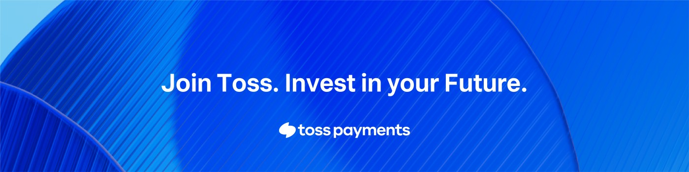
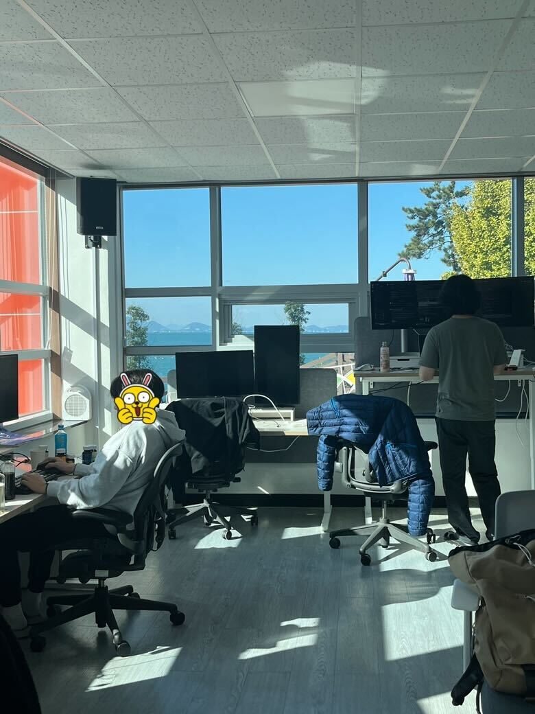
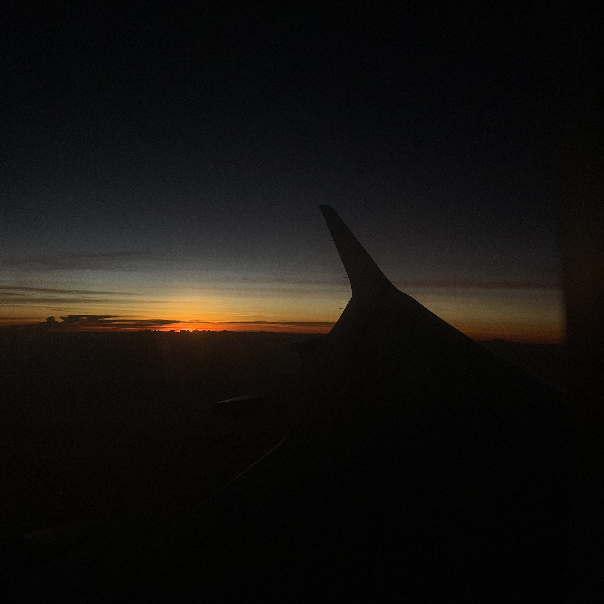
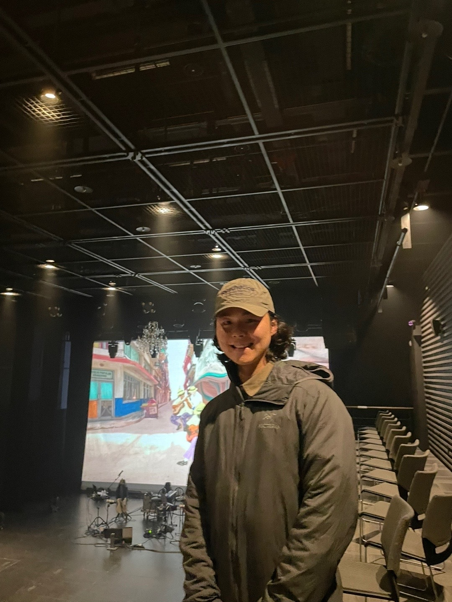
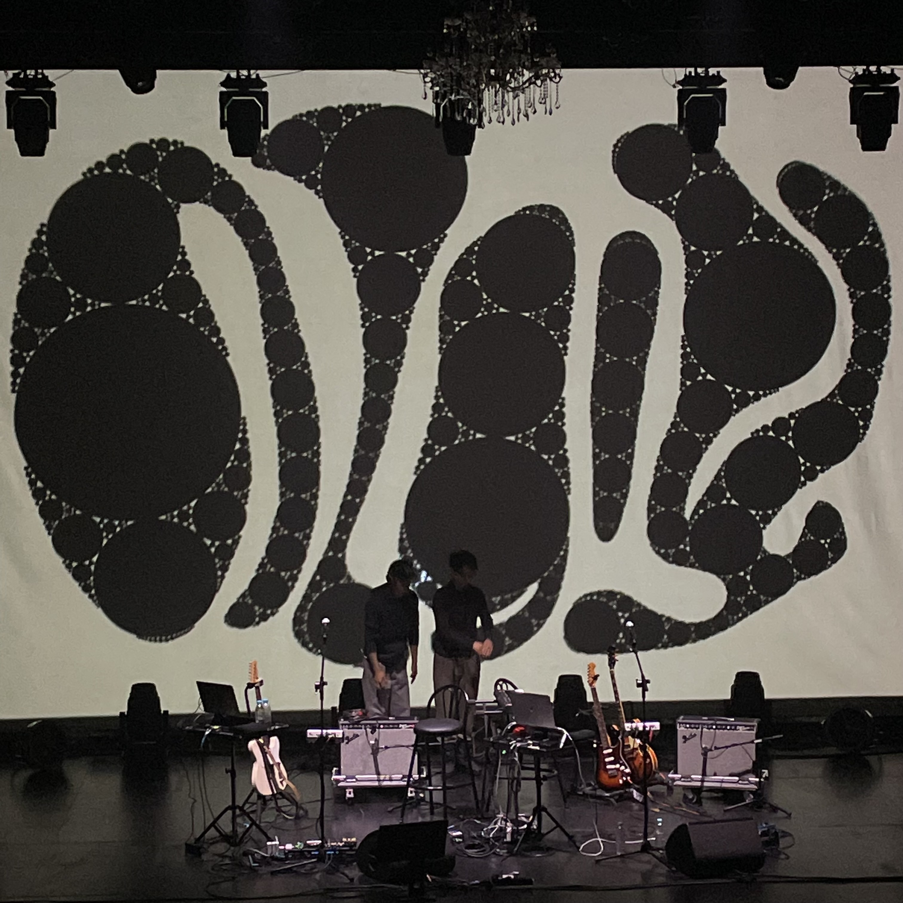
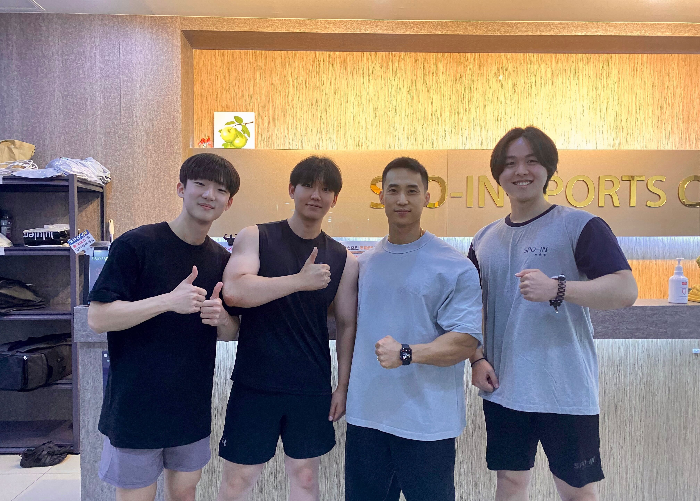
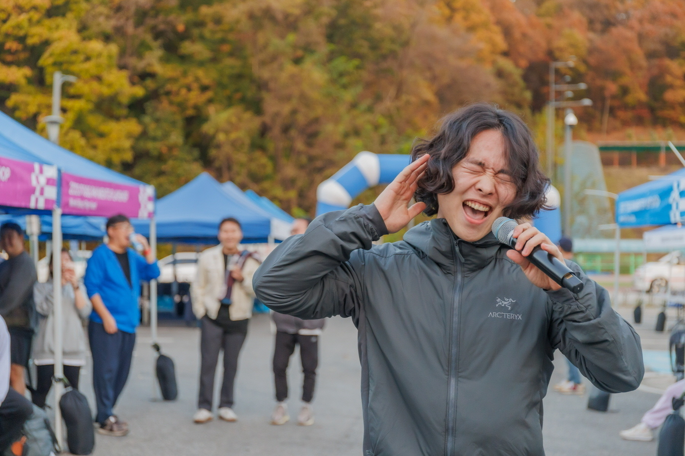
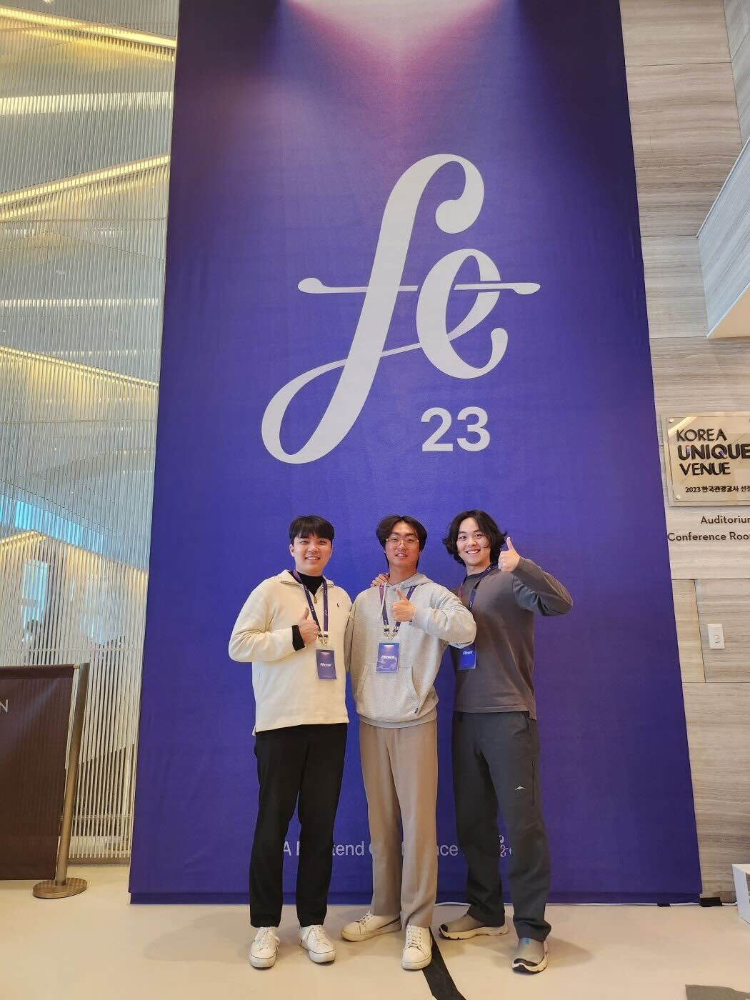

# 들어가며

이 글을 읽으시는 분들 2023년도 다들 고생하셨습니다. **자신에게 30초 정도 칭찬하는 시간을 갖고 읽어주세요!**

회고보다 **연기**라는 단어를 택한 이유는, 일기처럼 써내려가면 한 해를 내가 느낀 그대로의 감정을 표현할 수 있다고 생각했다. 그래서 약간 무거운 회고라는 단어보다 연기라는 단어를 택했다.

---

# 무신사 프론트엔드 개발자

평소에 패션에 관심이 많아서 무신사라는 회사에 관심이 있었었고, 그 회사에서 운영하는 29CM라는 사업의 프론트엔드 개발을 맡는 직무를 채용하는 공고에 지원하여 입사까지 할 수 있었다. 2023년 첫째 주에 바로 입사했던 기억이 난다, 회사가 자사 서비스를 운영하는 회사가 처음이었었어 서비스에 대한 애정을 가질 생각에 너무 설렜던 것 같다. 이력서 및 내가 해온 활동들을 토대로 업무를 배치받았고 Product Developer보다는 Platform Developer로 더 적합하다는 의견이 있었다. Frontend Platform Team의 초기 구성원으로 합류했다.

스쿼드 구성원분들이 비즈니스 임팩트를 더 빨리 낼 수 있도록 기술적으로 서포팅하기 위한 시간을 보냈었다. **생산성을 저해하는 요소들이 무엇인지, 그것을 시스템적으로 해결할 수 있는지 고민하고 실행하는 시간을 가졌다.**

약 6개월간 이 조직에서 아래와 같은 업무를 진행했다.

- storybook PR preview 개발환경 구축
- github cloud runner를 self-hosted runner로 migration
- Design System(ruler) token 정의 및 모노레포 환경 구축
- 모놀리식 서비스를 마이크로 서비스로 분리 및 공통화
- 유저 인증 영역 개발 및 유지보수

처음으로 겪는 대규모 프론트엔드 조직이었고, 비교적 짧은 시간 조직에 속해있었지만, 개발자로서의 많은 성장을 하였고 구성원분들과 매우 친해질 수 있었다. 29CM에서 개발할 때 느낀 점은 해보고 싶은 일이 있다면 회사 차원에서 충분히 장려해주는 선진적인 문화를 가졌다는 것이다. 새로운 기술이나, 패턴 등을 적용해보고 싶다면 구성원분들이 자기 일처럼 지속해서 서포팅해주려는 적극적이고 능동적인 구성원분들이 대부분이어서 너무 즐겁게 개발할 수 있었다.

프론트엔드팀 분들과 워케이션도 다녀오고, 매주 목요일에는 늦은 시간까지 회사 업무를 진행한 뒤, 소문난 성수 감자탕을 먹는 감데(감자탕 데이) 도 가지곤 했다. 확실히 젊은 분들이 많이 계신 조직이라서 그런지 활발하고, 에너제틱 하다는 느낌을 많이 받았다.

**흥미와 맞는 업무를 한다는 것이 얼마나 중요한지 깨달을 수 있었다.** 평소 패션과 이커머스에 관심이 많아서, 소비자들이 어떠한 플로우를 겪고 어느 부분에서 페인포인트를 느끼는지 고객 관점에서 알 수 있었고, 그런 문제를 하나하나 해결해나가는데 희열을 느꼈었다.

29CM조직은 외부에 알려진 것 처럼 몸담았을 때 너무나 좋은 점 투성이였다. 지금도 가끔은 그때의 구성원들과 보냈던 하루하루가 생각나기도 한다. 아마 현재 토스로의 이직이 없었다면, 당연히 다른 곳으로 떠나지 않고 29CM에서 즐겁게 개발했을 것 같다.

버디로서 많은 부분도와주신 예준님, 그리고 프론트엔드 팀 분들 정말 감사했습니다!

---

# 토스페이먼츠 프론트엔드 개발자

6월 매미가 울기 시작할 때 즈음 토스페이먼츠 프론트엔드 개발자로 업무를 시작하게 되었다.

처음 HTML에 hello world를 띄울 때부터 토스커뮤니티가 개발자로서의 목표였고, 계속되는 문 두들김을 통해 결국엔 입사할 수 있었다.
입사가 너무 설레어서 무신사를 금요일날 퇴사하고 토스에 월요일날 합류했다.

한국에서 가장 프론트엔드 개발을 잘한다고 생각했고, 얼마나 내부 코드를 잘 구현했으면, 급격한 비즈니스 성장도 이뤄낼 수 있었을까 하는 부분이 너무 궁금했었다.

정말로 입사하고 보니, 생각했던 것 그 이상으로 **토스커뮤니티는 대단한 한 획을 긋고 있었다.** 불필요한 반복작업은 당연히 모두 시스템화되어있고 내가 불필요하다고 생각하지도 못한 부분까지도 모두 시스템화되어있어서 업무 효율을 극대화하고 있는 조직이라고 생각했다.

토스에 들어오기 전에는, 사이드 프로젝트나 외부 스터디 같은 다양한 분야의 활동을 즐겼는데, 오히려 토스에 들어오니 내부에 배울 점이 너무 많고 내부 코드를 익히는데도 수많은 노력이 필요하다고 생각해서 Focus on Impact를 하기로 마음먹고 회사 내 활동에만 전념하기로 마음먹었다. 실제로 코드베이스도 엄청나게 크고, 금융 비즈니스 맥락도 복잡하므로 아직 익혀야 할 부분이 많이 남았다.

처음에는 상점계약팀으로 입사하여, 가맹점 분들이 처음 토스페이먼츠와의 계약을 더 쉽고 편하게 하실 수 있도록 도와주는 작업을 주로 하였고, 팀이 Product Foundation Team이라는 새로운 팀으로 합쳐져 토스페이먼츠 내부 직원분들이 사용하시는 서비스까지 맡는 팀에 속하여 개발하였다. 이 팀에서 맡는 일은 주로 새로운 서비스를 0부터 1로 만들기보다는 더 단단하게 제품을 1에서 100으로 만드는 팀이었다.

토스에 입사할 때 빠르게 이터레이션을 돌며 수많은 실험을 하고, 유저의 반응을 보며 제품을 빠르게 수정하는 0에서 1을 만드는 사일로 업무를 해보고 싶었고 마침 퀵계좌이체 사일로에 프론트엔드 인력이 필요한 상황이어서 챕터 리드분과 대화를 통해 팀이 동을 하게 되었다.

첫 사일로를 경험해보니, 역시 나는 제품을 개발하여 유저의 반응을 보는데 만족감을 느낀다고 생각했고, 구성원 모두가 강하게 밀집하여 직무와 상관없이 하나의 목표만을 이루기 위해 각자의 일을 해나가는 과정에서 같이 일한다는 생각이 많이 들어서 행복했던 것 같다. 업무를 진행하는데 사람 간의 소통을 크게 중요하게 생각하는 나에게는 너무 잘 맞는다고 생각했다. 매번 실험 결과를 볼 때마다 도파민에 휩싸여서 수치의 오름과 내림을 보며 희열을 느끼는 우리 사일로 구성원들이 매우 좋았고 재밌었다.

프론트엔드 챕터 구성원분들을 보면 구성원마다 강력한 자신만의 스킬을 가지고 있다. 예를 들면 테스트 코드에 대한 고민이 있을 때는 누구를 찾아가면 해결해줄 것이고, 설계에 관한 고민은 누구, 커뮤니케이션, 채용 등 각자 구성원분마다 강력한 무기가 있다. 나를 돌이켜보면 내가 어떤 강점이 있고, 어떤 부분에 문제가 생겼으면 누가 날 찾아올까? 라는 생각을 했다. **나도 2024년에는 나만의 무기를 만들어, 누군가에게 도움을 줄 수 있는 스킬을 갈고 닦으려고 한다.**

---

# 워케이션

토스팀의 지원으로 남해오피스에 일주일동안 워케이션을 다녀왔다. 귀를 울리는 경적소리와, 바쁜 사람들의 발걸음이 있는 테헤란로를 떠나. 오피스에서 파도소리를 들을 수 있는 곳에서 **워케이션을 다녀오니 한번 더 몰입하여 달릴 수 있는 터닝포인트가 되었다.** 반복되는 일상 속 이러한 짧은 변화구가 큰 긍정적인 영향을 준다는 사실을 깨달았다. 팀원들 간의 라포 형성에도 큰 도움이 되어 더욱 업무 효율이 높아졌다는 체감이 들었다. 리모트 근무가 가능하거나, 회사 차원에서 워케이션을 지원해준다면 꼭 많은 분이 누려봤으면 좋겠다. 비용 그 이상의 긍정적인 가치가 있다고 생각하기 때문이다.

---

# 커피챗

다양한 경로로 다양한 개발자분들과 커피챗을 진행했던 한 해였다.

이제 막 개발을 시작하시는 분들, 개발을 어느 정도 공부한 뒤 취업 시장에 뛰어드신 분들, 전 직장이 있지만, 이직을 하시는 분들 등 많은 분을 만나고 다양한 환경의 개발자들의 값진 이야기를 듣는 시간을 가질 수 있었다. 각자의 자리에서 각자의 목표를 향해 노력하고 있는 부분들이 멋지다고 생각했다. 개발 시장에 대한 전체적인 흐름도 알 수 있어서 좋았다. 커피챗이 생각보다 들어가는 리소스가 많다고 생각하여 너무 자주가 아닌 2024년에도 2023년과 비슷하게 한 달에 한 건 정도 하면 좋을 것 같다.

---

# 여행

많은 여행을 다닌 한해였다. 대부분은 여자친구와 다녔고, 이전 직장 사람들과도 여행을 떠났던 적이 있다. 국내, 국외를 가리지 않고 많은 곳을 다니려고 했고 가장 중요하게 생각한 것은 여행 중에는 업무에 대해 신경을 차단하고 개인과, 같이 여행 중인 사람들, 여행 그 자체의 공간에 집중하고자 하였다. 이러한 **일과 삶의 분리와 몰입을 통해 충분한 휴식을 취하면, 다시 업무로 복귀하였을 때도 몰입도 높게 일할 수 있다고 생각하기 때문이다.** 하지만 개인적으로 이 부분은 잘 지키지 못했던 것 같아 아쉽다. 여행 중인 시간에도 가끔은 머릿속에 일 일부가 떠오르곤 했다.

- 후쿠오카
- 오사카
- 가평
- 제주도
- 부산
- 푸꾸옥
- 여의도 불꽃놀이
- …

---

# 92914 콘서트

가장 좋아하는 그룹의 콘서트에 다녀왔다. 라이브로 노래를 들은 것 그 이상으로 준비된 영상과, 라이브에 맞춘 편곡 곡 도입 방법 등 모든 부분이 너무 감동적이었다. 명상하는 것과 같은 기분으로 노래를 들을 수 있었고 일상 속 힐링을 느낄 수 있는 콘서트였다. 내 깃허브 아이디가 **okinawaa**인 이유도 92914의 대표곡이기 때문이다.

---

# 약간의 무력감

개발을 시작할 때부터 가졌던 큰 꿈이자 목표였던 토스커뮤니티에 합류하자, 장기적인 목표가 사라졌다는 생각에 무력감에 빠졌던 것 같다. 물론 현재에도 작은 목표들은 여러 가지가 있지만, 몇 년을 투자해서 이룰 수 있는 장기적인 목표를 세울 필요가 있다고 생각한다. 나 자신이 목표지향적인 사람이란 걸 알기 때문에 큰 목표가 없다면 삶 속에서 쉽게 흔들려버릴 수 있다고 생각하기 때문이다.

---

# 운동

2023년에는 근력 운동과, 유산소 운동을 적절한 비율로 진행했던 것 같다.

주 4 ~ 5회는 헬스장에서 근력 운동을 했고, 1~2주에 한 번씩 풋살과, 자유 수영을 진행했다.

기회가 된다면 수영을 제대로 배워보고 싶다. 지금은 왔다갔다만 하는 수준이다.

개발자 특성상 앉아있는 시간이 많아서 시작했던 운동이지만 이제는 가기 싫은데 헬스장을 가는 시기는 지나서 하루 사이클의 한 부분으로 자연스럽게 자리 잡았다. 꾸준히 해왔던 것처럼 2024년에도 유지하려고 한다.

친구들끼리 유명 유튜버가 하는 헬스장에 일일권을 등록하여 운동도 하곤 했다.

---

# 보컬

예전부터 노래를 잘 부르는 게 꿈이어서, 보컬학원도 다녀봤지만 좀처럼 나아지지 않았다. 직장인이라 그렇다는 핑계로 자주 연습하지 않았던 것 같다. 연습하지 않고 학원만 다닌다고 실력이 늘 것이라고 바보 같은 오해를 했었다. 2024년에는 많은 연습을 통해 꼭 노래를 잘 부르고 싶다.

---

# 독서

개발 외적으로도 많은 책을 읽어보고 싶었지만, 개발 관련 서적만 읽었던 한해였다. 2024년에는 개발 외 서적도 읽을 수 있는 한 해가 되길 바란다.

---

# 컨퍼런스

2023년에는 인프콘, feconf2023, 테오콘 이라는 컨퍼런스를 다녀왔다. 다음에 영상으로 세션 영상을 올려준다고 하더라고, 현장에서 실시간으로 듣는 것은 몰입도가 차원이 다르다고 느꼈다. 2024년에도 컨퍼런스를 갈 기회가 있다면 꼭 방문해서 발표자와 같은 공기를 마시고 싶다.

---

# Action Item

> 경험의 가치는 그 경험이 끝난 후에 무엇을 하느냐에 의해 결정된다.

- 토스팀에서 인정받을 수 있는 강력한 스킬 만들기
- 개발 외 서적 2건 이상 읽기
- 노래 한곡을 편하게 완곡 할 수 있는 보컬 실력 기르기
- 3대(스쿼트, 데드리프트, 벤치프레스) 350 돌파하기
- 5년 후, 10년 후 미래를 상상하며 이루고 싶은 큰 목표 세우기

모두 2024년 화이팅입니다!
